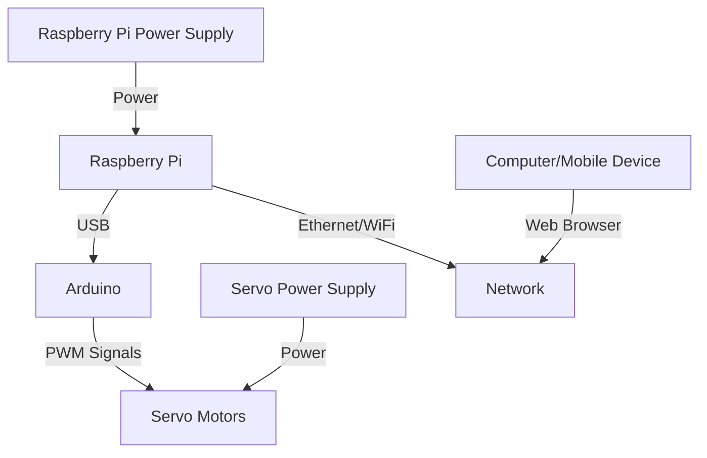

# BCN3D Moveo Control System

A complete control system for the BCN3D Moveo robot arm with a modern web interface built with Next.js, ROS2 integration, and Arduino firmware.

## Project Overview

This project provides a full-stack solution for controlling the BCN3D Moveo robot arm with:

- **Modern Web Interface**: Colorful, intuitive UI built with Next.js
- **Real-time Communication**: WebSocket communication with ROS2 via ROSBridge
- **Joint and Cartesian Control**: Control the robot in either mode with visual feedback
- **3D Visualization**: Real-time visualization of the robot arm
- **System Health Monitoring**: Track connection status and robot state

## System Architecture

### Hardware Connection Diagram



### Web Interface


## Prerequisites

- ROS2 Humble (on Raspberry Pi or Ubuntu machine)
- Node.js 16+ and pnpm or npm
- Arduino IDE
- BCN3D Moveo robot arm with servos connected to Arduino

## Installation

### 1. ROS2 Setup (on Raspberry Pi)

```bash
# Clone the repository
git clone https://github.com/ayuugoyal/bcn-3d-control-system.git
cd bcn/moveo_ros2

# Install dependencies
sudo apt install -y ros-humble-rosbridge-suite

# Build the ROS2 workspace
colcon build
source install/setup.bash
```

### 2. Arduino Firmware

1. Open the Arduino IDE
2. Load the firmware from `arduino/moveo_firmware.ino`
3. Update the pin configurations if needed
4. Upload to your Arduino board
5. Connect the Arduino to your Raspberry Pi via USB

### 3. Web Interface

```bash
# Navigate to web interface directory
cd bcn/bcn3d-moveo-control

# Install dependencies
pnpm install

# Start the server
pnpm run dev
```

## Usage

### Starting the System

1. **Start the ROS2 nodes on Raspberry Pi**

```bash
source ~/bcn/moveo_ros2/install/setup.bash
ros2 launch moveo_bringup moveo_system_launch.py
```

2. **Access the Web Interface**

Open a browser and navigate to:
```
http://raspberry-pi-ip:3000
```
(Replace `raspberry-pi-ip` with your Raspberry Pi's IP address)

3. **Connect to ROSBridge**

- Go to the Control Panel page
- Enter the ROSBridge endpoint: `ws://raspberry-pi-ip:9090`
- Click "Connect"

4. **Control the Robot**

Once connected, you can:
- Use joint sliders to control individual joints
- Use the cartesian control panel for end-effector positioning
- Control the gripper
- View the 3D representation of the robot
- Monitor connection status and joint positions

## System Components

### ROS2 Nodes

- **ROSBridge**: Provides WebSocket server for communication with the web interface
- **Moveo Controller**: Handles robot control logic and Arduino communication
- **Robot State Publisher**: Publishes the robot's state for visualization
- **Joint State Publisher**: Publishes joint states from the robot

### Arduino Firmware

- Controls the servos based on commands from ROS2
- Reports joint positions back to ROS2
- Handles smooth interpolation between positions

### Web Interface

- Connects to ROSBridge WebSocket server
- Provides UI for controlling the robot
- Visualizes the robot in 3D
- Shows system status and joint positions
